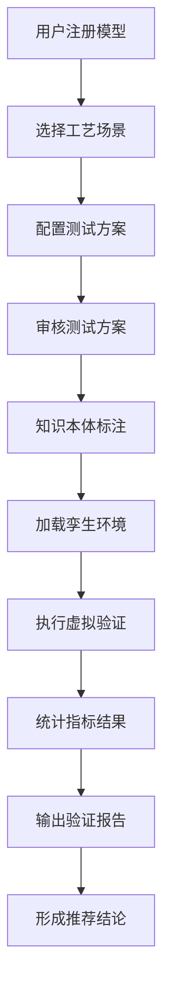
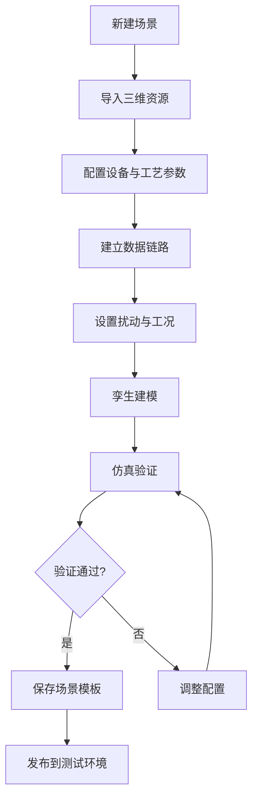
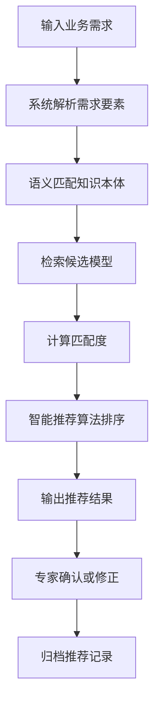

# 课题1系统 PRD（功能需求版 V2.0）

---

## 文档信息

| 项目 | 内容 |
|------|------|
| 文档版本 | V2.0 |
| 编写日期 | 2026年5月 |
| 编写人 | |
| 审核人 | |
| 状态 | 初稿 |

## 修订记录

| 版本 | 日期 | 修订内容 | 修订人 |
|------|------|----------|--------|
| V1.0 | | 初始版本 | |
| V2.0 | 2026年5月 | 补充术语表、非功能需求、外部接口规范，基于课题技术报告深化功能描述 | |

---

## 1. 产品名称

面向动态场景适配的垂域模型多元评估与虚拟验证系统

---

## 2. 产品定位

本系统用于对工业垂域模型进行统一接入、场景构建、虚拟验证、指标评测、推荐匹配与测试报告输出，支撑焊接、打磨、装配等离散制造场景下垂域模型的验证与应用。

本系统通过构建**模型知识本体与管控框架**、**标准化通信技术**、**多元多维评估体系**和**数字孪生验证系统**，实现低成本虚拟验证与客观有效性能评估。

---

## 3. 使用对象

| 角色 | 职责描述 |
|------|----------|
| 算法人员 | 上传模型、查看评测结果、对比优化版本 |
| 工艺专家 | 配置工艺场景、定义指标权重、审核测试方案 |
| 测试人员 | 执行测试、采集结果、生成报告 |
| 平台管理员 | 管理资源、权限、日志、系统配置 |
| 业务用户 | 检索模型、发起验证、查看推荐结果 |

---

## 4. 术语表

| 术语 | 定义 |
|------|------|
| **垂域模型** | 针对特定工业场景（如焊接、打磨、装配）训练的专用人工智能模型，具备领域知识理解和任务执行能力 |
| **数字孪生** | 物理实体或系统在数字空间的全生命周期映射，支持实时数据同步、仿真分析和智能决策 |
| **虚实同步** | 虚拟环境与真实物理系统之间的状态、事件和指令的实时双向数据交互 |
| **场景适配** | 模型在不同工艺、不同产线、不同数据条件下的适用性分析与匹配 |
| **三级指标体系** | 综合评估层（一级）、分析诊断层（二级）、执行度量层（三级）的分层评价指标架构 |
| **孪生验证** | 基于数字孪生环境进行的虚拟仿真验证，支持模型性能的快速评估 |
| **知识本体** | 对垂域模型进行语义化描述的规范化框架，涵盖模型类型、场景、参数、约束、输入输出接口、功能、性能等特征 |
| **服务契约** | 垂域模型与工业系统间交互接口的标准化语义描述，支撑跨系统语义交互操作 |

---

## 5. 范围说明

本PRD描述课题1系统功能需求，涵盖：
- 垂域模型知识本体构建与管控技术
- 垂域模型与工业系统标准化通信技术
- 面向场景的垂域模型多元评估技术
- 适配动态场景的数字孪生验证系统

本PRD不展开项目背景、技术路线详细实现和实施计划，相关内容参见项目技术方案文档。

---

# 6. 非功能需求

## 6.1 性能要求

| 指标项 | 要求 |
|--------|------|
| 系统响应时间 | 普通操作 ≤ 2秒，复杂查询 ≤ 5秒 |
| 模型推理延迟 | 云侧 ≤ 100ms，端侧 ≤ 50ms |
| 虚实同步延迟 | ≤ 50ms（端到端） |
| 并发用户数 | 支持至少 50 个并发用户 |
| 数据吞吐量 | 日志写入 ≥ 1000条/秒 |
| 三维模型加载 | 单个模型 ≤ 3秒（≤ 50MB） |

## 6.2 可靠性要求

| 指标项 | 要求 |
|--------|------|
| 系统可用性 | ≥ 99.5% |
| 数据备份 | 每日增量备份，每周全量备份 |
| 故障恢复 | RTO ≤ 4小时，RPO ≤ 1小时 |
| 日志保留 | 操作日志 ≥ 1年，关键日志 ≥ 3年 |

## 6.3 安全性要求

| 指标项 | 要求 |
|--------|------|
| 身份认证 | 支持账号密码、LDAP集成 |
| 传输加密 | 全站HTTPS |
| 数据隔离 | 项目间数据完全隔离 |
| 敏感操作 | 二次确认与审批流 |
| 审计合规 | 符合工业数据安全要求 |

## 6.4 兼容性要求

| 指标项 | 要求 |
|--------|------|
| 浏览器支持 | Chrome/Edge/Firefox 最新两版本 |
| 三维格式支持 | 至少10种（STEP, IGES, STL, OBJ, FBX, glTF, 3DS, PRT, CATPart, SLDPRT） |
| 协议支持 | MQTT, OPC UA, Modbus TCP, HTTP/REST |

## 6.5 可维护性要求

| 指标项 | 要求 |
|--------|------|
| 系统监控 | 支持CPU、内存、磁盘、网络监控 |
| 日志管理 | 结构化日志，支持日志级别配置 |
| 配置管理 | 支持在线配置，配置变更需审计 |
| 扩展能力 | 模块化设计，支持插件扩展 |

---

# 7. 总体功能架构

系统应包含以下功能模块：

| 序号 | 模块名称 | 说明 |
|------|----------|------|
| 1 | 模型知识本体与管控 | 基于知识图谱的模型语义化管理、生命周期管理、智能匹配推荐 |
| 2 | 标准化通信服务 | 跨层级系统集成、接口契约规范化、协议自适应接入 |
| 3 | 工业数据与三维资源接入 | 设备数据接入、三维模型库管理、数据与模型关联 |
| 4 | 场景建模与数字孪生验证 | 场景创建、仿真运行、扰动注入、孪生建模 |
| 5 | 虚实同步与联动控制 | 数据同步、通信链路、协议转换、联动控制 |
| 6 | 垂域模型评测与指标库 | 三级指标体系、评估引擎、权重管理、结果分析 |
| 7 | 测试方案编制与执行 | 测试方案管理、用例库、自动化测试、结论判定 |
| 8 | 模型推荐与场景匹配 | 需求输入、智能匹配、推荐展示、人工干预 |
| 9 | 结果展示与报表中心 | 看板、报告中心、对比分析、问题清单 |
| 10 | 权限、日志与系统管理 | 账号权限、审计留痕、系统配置 |

---

# 8. 功能需求明细

## 8.1 账号与权限管理

### 8.1.1 用户登录

| 功能点 | 详细描述 |
|--------|----------|
| 基础认证 | 支持账号密码登录 |
| 组织权限 | 支持按组织机构、角色、项目分配访问权限 |
| 单点登录 | 支持与现有LDAP/AD系统集成 |
| 会话管理 | 支持超时自动退出（可配置，默认30分钟） |
| 密码管理 | 支持密码修改、密码重置（通过邮箱/手机验证码） |

### 8.1.2 角色管理

| 角色 | 权限说明 |
|------|----------|
| 平台管理员 | 系统配置、权限分配、资源管理 |
| 场景建模人员 | 场景创建、孪生建模、仿真配置 |
| 算法工程师 | 模型上传、版本管理、评测发起 |
| 工艺专家 | 场景配置、指标权重、测试方案审核 |
| 测试执行人员 | 测试执行、数据采集、报告生成 |
| 审核人员 | 测试方案审核、模型入库审批 |
| 普通查看用户 | 查看模型、查看报告、查看看板 |

### 8.1.3 权限控制

| 权限级别 | 说明 |
|----------|------|
| 菜单级 | 控制功能模块的可见性 |
| 功能级 | 控制具体操作权限（增删改查执行等） |
| 数据级 | 控制数据范围（项目隔离、场景隔离、模型隔离） |

### 8.1.4 审计留痕

| 功能点 | 详细描述 |
|--------|----------|
| 行为记录 | 记录登录、登出、创建、修改、删除、发布、审批、导出等行为 |
| 日志检索 | 支持按时间、用户、项目、模块、操作类型检索 |
| 日志保护 | 关键操作日志不可删除、不可修改 |
| 日志格式 | 结构化日志，包含时间戳、用户ID、操作类型、IP地址等 |

---

## 8.2 模型知识本体与管控（任务1-1）

### 8.2.1 知识本体框架

| 功能点 | 详细描述 |
|--------|----------|
| 本体建模 | 基于知识图谱技术，围绕模型类型、场景、参数、约束、输入输出接口、功能、性能等特征构建垂域模型知识本体框架 |
| 语义管理 | 实现模型资产的语义化管理与功能规范化 |
| 本体可视化 | 支持知识图谱可视化展示模型关联关系 |
| 本体查询 | 支持基于SPARQL的本体知识查询 |

### 8.2.2 模型封装与实例化

| 功能点 | 详细描述 |
|--------|----------|
| 封装工具 | 提供垂域模型封装工具，统一模型的结构表征与交互接口 |
| 实例化管理 | 支撑模型的跨平台集成与虚拟验证环境的快速部署 |
| 接口标准化 | 定义统一的模型调用接口、数据格式、协议规范 |

### 8.2.3 模型生命周期管理

| 功能点 | 详细描述 |
|--------|----------|
| 状态流转规范 | 设计垂域模型生命周期状态流转规范，明确模型的关键阶段及核心关口 |
| 版本控制 | 制定多维度版本控制与记录规则，支持历史版本追溯 |
| 优化追溯 | 构建基于本体的模型优化与迭代追溯策略，有效评估优化效果 |
| 配置一致性 | 构建模型配置与状态一致性保障机制，确保模型调用接口在生命周期内保持同步一致 |

**生命周期状态图：**

```
草稿 → 待审核 → 已入库 → 验证中 → 验证完成 → 推荐中 → 已推荐 → 已下线
                        ↓
                   验证失败（可重新发起验证）
```

### 8.2.4 模型注册

| 必填信息 | 说明 |
|----------|------|
| 模型名称 | 模型标识名称 |
| 模型类型 | 检测、规划、控制、识别、推荐等 |
| 所属行业 | 汽车、航空、电子等 |
| 适用工艺 | 焊接、打磨、装配等 |
| 输入说明 | 输入数据格式、尺寸要求 |
| 输出说明 | 输出结果格式、含义 |
| 版本号 | 语义化版本号（如1.0.0） |
| 训练数据 | 训练数据来源描述 |
| 依赖环境 | 运行时依赖（框架、库、硬件） |
| 部署方式 | 云侧、边缘、端侧、混合部署 |
| 适用场景 | 具体应用场景描述 |
| 责任人 | 模型负责人 |
| 功能描述 | 基于知识本体的语义化功能描述 |
| 性能指标 | 精度、延迟、吞吐量等预期性能 |

### 8.2.5 模型上传

| 功能点 | 详细描述 |
|--------|----------|
| 文件类型 | 支持模型文件、配置文件、权重文件、推理脚本、依赖说明 |
| 批量上传 | 支持多文件批量上传 |
| 增量上传 | 支持版本增量上传，仅上传变更部分 |
| 上传校验 | 格式校验、完整性校验、版本重复校验 |
| 文件限制 | 单文件 ≤ 500MB，单次上传 ≤ 2GB |
| 断点续传 | 支持大文件断点续传 |

### 8.2.6 模型分类体系

| 分类维度 | 类别 |
|----------|------|
| 工艺类型 | 焊接、打磨、装配、检测、喷涂等 |
| 任务类型 | 检测、规划、控制、识别、推荐、预测等 |
| 数据类型 | 图像、视频、点云、时序、文本、多模态等 |
| 部署类型 | 云侧、边缘、端侧、混合部署 |
| 验证状态 | 未验证、验证中、已验证、验证失败、已推荐 |

### 8.2.7 模型版本管理

| 功能点 | 详细描述 |
|--------|----------|
| 版本操作 | 创建、升级、回滚、冻结、废弃 |
| 版本记录 | 记录每个版本的指标结果、适用场景、测试记录 |
| 版本对比 | 支持版本间差异对比（参数、性能、功能变化） |
| 版本标签 | 支持为版本添加标签（如"稳定版"、"测试版"） |

### 8.2.8 模型元数据管理

| 功能点 | 详细描述 |
|--------|----------|
| 元数据项 | 输入尺寸、输出格式、推理耗时、资源占用、精度指标 |
| 约束条件 | 适用条件、限制条件、禁用条件 |
| 导入导出 | 支持元数据Excel/JSON导入导出 |

### 8.2.9 模型智能匹配与推荐（任务1-1核心）

| 功能点 | 详细描述 |
|--------|----------|
| 语义映射 | 设计应用场景—模型要素协同的语义映射机制，解析用户需求与垂域模型知识本体特征进行语义匹配 |
| 推荐算法 | 研究多目标模型推荐算法，将验证误差、推理效率及硬件资源需求作为评估因子 |
| 决策分析 | 结合模糊逻辑或多属性决策分析方法，实现模型自适应推荐 |
| 推荐结果 | 输出推荐模型排序列表及推荐理由 |

---

## 8.3 标准化通信服务（任务1-2）

### 8.3.1 系统集成架构

| 功能点 | 详细描述 |
|--------|----------|
| 架构设计 | 设计感知—决策—执行闭环架构，明确PLM、MES、SCADA、数字孪生体、垂域模型的功能边界与数据流向 |
| 层级支持 | 支撑设备级、工站级、产线级的跨层级数字化集成 |
| 服务接口 | 制定模型应用与服务接口规范，定义数据结构、调用协议和安全认证机制 |
| 孪生绑定 | 构建数字孪生体与垂域模型的绑定机制，支撑状态同步、数据关联和闭环控制 |

### 8.3.2 接口服务契约

| 功能点 | 详细描述 |
|--------|----------|
| 语义描述 | 基于统一信息模型的接口服务契约，将业务交互意图语义化抽象为机器可理解的原子服务与组合服务 |
| 契约规范 | 涵盖资源标识符、数据负载、服务质量（QoS）保障级别等 |
| 服务注册 | 构建服务契约的注册、发现与执行引擎 |
| 透明调用 | 通过服务网关模式，支撑上层应用对垂域模型的透明、按需、安全调用 |

### 8.3.3 协议适配引擎

| 功能点 | 详细描述 |
|--------|----------|
| 插件架构 | 基于SDN思想的动态协议适配引擎，通过插件化架构支撑Modbus、OPC UA、MQTT等协议的即插即用与动态加载 |
| 协议转换 | 制定协议数据与统一信息模型间的映射规则与转换标准 |
| 规则引擎 | 通过配置化的规则引擎，支撑原始协议数据到具有语义的标准信息模型的自动转换 |
| 协议支持 | 支持MQTT、OPC UA、Modbus TCP、HTTP/REST及可扩展自定义协议 |

### 8.3.4 智能通信调度

| 功能点 | 详细描述 |
|--------|----------|
| 链路感知 | 实时监测网络延迟、负载与抖动 |
| QoS路由 | 结合上层服务的QoS需求，动态选择或切换最优通信路径与参数 |
| 延迟控制 | 有效降低通信延迟，端到端延迟 ≤ 50ms |
| 负载均衡 | 支持多通道负载均衡 |

### 8.3.5 工业数据接入

| 功能点 | 详细描述 |
|--------|----------|
| 数据类型 | 设备数据、工艺数据、质量数据、传感器数据、日志数据 |
| 多源同步 | 支持多源数据同步接入 |
| 分组管理 | 支持按项目、产线、工站、设备进行分组管理 |
| 数据校验 | 字段完整性、时间戳连续性、数据格式合法性校验 |
| 异常处理 | 支持异常数据拦截、标记、隔离 |

---

## 8.4 工业数据与三维资源接入

### 8.4.1 三维模型接入

| 功能点 | 详细描述 |
|--------|----------|
| 格式支持 | 支持不少于10种三维模型格式（STEP, IGES, STL, OBJ, FBX, glTF, 3DS, PRT, CATPart, SLDPRT等） |
| 格式识别 | 自动识别模型格式 |
| 格式转换 | 开发通用格式转换引擎，破除数据壁垒，实现跨格式转换 |
| 模型预览 | 支持在线预览三维模型 |
| 格式解析 | 解析模型几何信息、层级结构、材质属性 |

### 8.4.2 三维模型轻量化

| 功能点 | 详细描述 |
|--------|----------|
| 简化算法 | 基于渐进网格简化算法对三维模型实施轻量化处理 |
| 空间压缩 | 八叉树空间压缩技术 |
| LOD支持 | 细节层次显示（Level of Detail） |
| 精度保留 | 在精准保留模型核心参数与几何精度的前提下提升加载速度 |

### 8.4.3 三维模型库管理

| 功能点 | 详细描述 |
|--------|----------|
| 分类管理 | 支持按设备、工站、工装、物料、环境等类别管理 |
| 统计分析 | 支持模型数量统计、使用频次统计 |
| 重复检测 | 支持三维模型重复检测 |
| 版本管理 | 支持模型版本管理 |
| 引用关系 | 支持模型引用关系管理 |

### 8.4.4 数据与模型关联

| 功能点 | 详细描述 |
|--------|----------|
| 关联建立 | 支持工业数据与三维资源、工艺场景、模型对象建立关联 |
| 映射关系 | 形成可追溯的数据-场景-模型映射关系 |
| 关联可视化 | 支持关联关系可视化展示 |

---

## 8.5 场景建模与数字孪生验证（任务1-4）

### 8.5.1 场景创建

| 功能点 | 详细描述 |
|--------|----------|
| 场景层级 | 支持设备级、工站级、产线级场景创建 |
| 场景管理 | 支持场景复制、模板复用、版本管理 |
| 新建方式 | 支持从零新建或基于模板创建 |

### 8.5.2 场景配置

| 配置项 | 说明 |
|--------|------|
| 设备与工装布局 | 三维空间中的设备位置和工装配置 |
| 工艺流程 | 工艺步骤定义和流程编排 |
| 传感器点位 | 传感器安装位置和参数配置 |
| 输入输出信号 | 信号定义、映射关系 |
| 环境参数 | 温度、湿度、光照等环境条件 |
| 工艺节拍 | 工序时间、周期时间 |
| 干扰因素 | 噪声、振动、干扰信号等 |
| 异常事件 | 预设异常场景和故障模式 |

### 8.5.3 场景模板库

| 功能点 | 详细描述 |
|--------|----------|
| 模板类型 | 支持焊接、打磨、装配等典型场景模板 |
| 参数化配置 | 支持模板参数化配置，可灵活调整 |
| 模板复用 | 支持模板复用到不同产线与工艺对象 |

### 8.5.4 数字孪生建模

| 功能点 | 详细描述 |
|--------|----------|
| 孪生对象 | 支持导入或编辑数字孪生对象 |
| 多维度建模 | 支持"几何—物理—运动—行为"多维度属性建模 |
| 层次化建模 | 支持对象级、工站级、产线级层次化建模 |
| 响应机制 | 构建能够准确映射设备输入输出信号的动态响应机制 |
| 控制逻辑 | 形成从工步、工序到工艺的逐层递进控制逻辑 |

### 8.5.5 几何与结构验证

| 功能点 | 详细描述 |
|--------|----------|
| 精度验证 | 验证三维模型几何精度 |
| 完整性检查 | 模型部件完整性检查 |
| 层级检查 | 模型结构层级检查与缺失告警 |

### 8.5.6 高性能虚拟场景引擎

| 功能点 | 详细描述 |
|--------|----------|
| 技术集成 | 集成实时渲染、高精度物理仿真与动力学仿真技术 |
| 场景搭建 | 支持拖拽式快速场景搭建的一体化建模体系 |
| 模型库 | 建设覆盖多品类、多行业的高精度三维几何模型库 |
| 高保真映射 | 实现物理产线到数字空间的高保真、多层次映射 |

### 8.5.7 场景仿真运行

| 功能点 | 详细描述 |
|--------|----------|
| 运行控制 | 支持启动、暂停、停止、重置场景仿真 |
| 运行模式 | 支持单步运行与连续运行 |
| 工况切换 | 支持不同工况下的仿真参数切换 |
| 实时显示 | 支持仿真过程实时可视化 |

### 8.5.8 扰动注入

| 功能点 | 详细描述 |
|--------|----------|
| 扰动类型 | 设备故障、信号丢失、工艺波动、节拍变化、环境变化等 |
| 扰动配置 | 支持定义扰动发生时间、持续时间、影响范围、恢复方式 |
| 组合扰动 | 支持多种扰动组合注入 |

### 8.5.9 场景结果记录

| 功能点 | 详细描述 |
|--------|----------|
| 记录内容 | 配置、参数、运行过程、输出结果、异常事件 |
| 结果回放 | 支持仿真结果回放与复盘 |
| 结果导出 | 支持仿真结果数据导出 |

### 8.5.10 闭环验证体系

| 功能点 | 详细描述 |
|--------|----------|
| 数据接入 | 工业软件数据接入与垂域模型验证的协同工作机制 |
| 实时推理 | 促进工业数据与垂域模型的深度融合，保证模型实时推理 |
| 闭环反馈 | 构建从"数据接入"到"模型验证"再到"结果反馈"的闭环验证体系 |
| 验证环境 | 为离散制造系统提供高保真、可重构的验证环境 |

---

## 8.6 虚实同步与联动控制

### 8.6.1 虚实数据同步

| 功能点 | 详细描述 |
|--------|----------|
| 同步类型 | 状态同步、事件同步、指令同步 |
| 同步机制 | 虚拟环境与真实系统的数据同步 |
| 延迟监测 | 支持同步延迟监测 |
| 超限告警 | 同步延迟超限自动告警 |

### 8.6.2 通信链路管理

| 功能点 | 详细描述 |
|--------|----------|
| 链路配置 | 虚拟系统、物理系统、工业软件之间的通信链路配置 |
| 状态监控 | 通信状态实时监控 |
| 自动重连 | 链路断开自动重连 |
| 错误隔离 | 支持错误隔离 |

### 8.6.3 协议转换

| 功能点 | 详细描述 |
|--------|----------|
| 转换配置 | 协议转换配置 |
| 映射管理 | 协议映射关系管理 |
| 转换日志 | 协议转换日志查看 |

### 8.6.4 联动控制

| 功能点 | 详细描述 |
|--------|----------|
| 指令下发 | 虚拟模型输出对物理系统的联动指令下发 |
| 状态反馈 | 物理系统状态反馈到虚拟环境 |
| 安全限制 | 联动过程的安全阈值限制 |
| 紧急停止 | 支持紧急停止指令 |

### 8.6.5 同步异常处理

| 功能点 | 详细描述 |
|--------|----------|
| 自动重试 | 同步失败自动重试（可配置重试次数和间隔） |
| 超时告警 | 超时触发告警 |
| 人工介入 | 支持人工介入恢复 |
| 异常记录 | 同步异常详细记录 |

---

## 8.7 垂域模型评测与指标库（任务1-3）

### 8.7.1 三级指标体系

| 层级 | 维度 | 说明 |
|------|------|------|
| 一级（综合评估层） | 效率、质量、成本、安全与环境 | 对模型效能进行宏观评价 |
| 二级（分析诊断层） | 精度、时间、鲁棒性、可解释性 | 对一级维度进行细化 |
| 三级（执行度量层） | 原子指标 | 与具体业务场景紧密关联、可直接量化 |

**一级指标示例：**

| 维度 | 说明 |
|------|------|
| 效率 | 模型推理速度、吞吐量、资源利用率 |
| 质量 | 准确率、召回率、F1值、误差率 |
| 成本 | 算力需求、存储需求、维护成本 |
| 安全 | 可靠性、容错性、异常检测能力 |
| 环境 | 场景适应性、抗干扰能力 |

### 8.7.2 指标库管理

| 功能点 | 详细描述 |
|--------|----------|
| 指标定义 | 支持建立模型评价指标库 |
| 分层管理 | 一级指标、二级指标、原子指标三级管理 |
| 指标属性 | 指标说明、计算方式、权重、阈值 |
| 指标集 | 支持按场景、行业、任务类型建立不同指标集 |
| 指标管理 | 指标增删改、版本管理、审核 |

### 8.7.3 指标智能推荐

| 功能点 | 详细描述 |
|--------|----------|
| 数据采集 | 制定细粒度、规范化的数据采集标准 |
| 知识融合 | 基于图表征整合实测历史数据与专家先验知识 |
| 语义挖掘 | 通过图神经网络挖掘指标、场景、数据之间深层语义关联 |
| 推荐算法 | 结合TagBased快速匹配和协同过滤模型，为待测模型快速抽取核心原子指标集 |
| 动态组装 | 动态组装形成场景专有的指标评价模块 |

### 8.7.4 评价标准管理

| 功能点 | 详细描述 |
|--------|----------|
| 标准库 | 支持建立评价标准库 |
| 场景配置 | 支持不同工艺场景下的标准配置 |
| 专家录入 | 支持专家知识录入、版本管理、审核 |
| 标准版本 | 支持评价标准版本控制 |

### 8.7.5 权重库管理

| 功能点 | 详细描述 |
|--------|----------|
| 权重配置 | 支持维护不同场景下的指标权重 |
| 多维度配置 | 支持按专家、行业、场景、任务类型配置权重 |
| 权重融合 | 基于机器学习方法构建多级指标主客观融合权重训练 |
| 动态调整 | 综合运用动态评估反馈方法动态建立主客观结合的权重分配 |
| 调整记录 | 支持权重对比与调整记录 |

### 8.7.6 评分引擎

| 功能点 | 详细描述 |
|--------|----------|
| 自动评分 | 支持按指标自动评分 |
| 评分类型 | 综合评分、分项评分、排序评分 |
| 版本对比 | 支持评分结果按模型版本对比 |
| 评分详情 | 支持查看详细评分计算过程 |

### 8.7.7 评测结果分析

| 功能点 | 详细描述 |
|--------|----------|
| 结果查看 | 查看各指标得分、达标情况、趋势变化 |
| 风险识别 | 定位低分指标和风险项 |
| 优化建议 | 基于分析结果生成优化建议 |

### 8.7.8 场景适配分析

| 功能点 | 详细描述 |
|--------|----------|
| 适配能力 | 分析模型在不同工艺、不同产线、不同数据条件下的适配能力 |
| 边界识别 | 识别模型适用边界与不适用边界 |
| 适配报告 | 生成场景适配分析报告 |

### 8.7.9 推荐精准率评估

| 功能点 | 详细描述 |
|--------|----------|
| 结果比对 | 对模型推荐结果与专家最优方案进行比对 |
| 指标统计 | 统计推荐准确率、命中率、召回率等结果 |
| 评估报告 | 生成推荐精准率评估报告 |

---

## 8.8 测试方案编制与执行

### 8.8.1 测试方案创建

| 功能点 | 详细描述 |
|--------|----------|
| 创建方式 | 支持按指标、按场景、按课题创建测试方案 |
| 方案内容 | 测试目的、测试对象、测试条件、测试步骤、测试数据、判定规则、责任人 |
| 方案模板 | 支持基于模板创建测试方案 |

### 8.8.2 测试方案审核

| 功能点 | 详细描述 |
|--------|----------|
| 提交审核 | 支持测试方案提交专家评审 |
| 评审意见 | 支持查看评审意见 |
| 修改记录 | 支持查看修改记录 |
| 复审状态 | 支持复审状态跟踪 |

### 8.8.3 测试用例管理

| 功能点 | 详细描述 |
|--------|----------|
| 用例生成 | 支持按指标自动生成或手工编写测试用例 |
| 版本管理 | 支持测试用例版本管理 |
| 用例复用 | 支持测试用例复用 |
| 用例库 | 建立测试用例库 |

### 8.8.4 测试执行

| 功能点 | 详细描述 |
|--------|----------|
| 执行模式 | 支持自动化测试、半自动化测试、人工辅助测试 |
| 过程控制 | 支持按步骤执行、暂停、回退、重跑 |
| 结果记录 | 记录每个测试步骤结果 |
| 分布式执行 | 支持分布式测试执行（可选） |

### 8.8.5 测试数据管理

| 功能点 | 详细描述 |
|--------|----------|
| 数据操作 | 支持测试数据导入、采集、标注、归档 |
| 数据关联 | 支持测试数据与测试方案、测试结果关联 |
| 数据集管理 | 建立测试数据集管理 |

### 8.8.6 测试结论判定

| 功能点 | 详细描述 |
|--------|----------|
| 自动判定 | 按预设阈值自动判定通过/不通过 |
| 阈值来源 | 阈值可基于行业标准或专家经验定义 |
| 人工复核 | 支持手工复核与专家确认 |

### 8.8.7 报告输出

| 功能点 | 详细描述 |
|--------|----------|
| 报告类型 | 测试报告、评审报告、阶段报告、终期报告 |
| 报告内容 | 测试对象、测试条件、结果明细、结论、问题清单、整改建议 |
| 格式支持 | 支持PDF、Word、HTML格式导出 |

---

## 8.9 模型推荐与场景匹配

### 8.9.1 需求输入

| 需求类型 | 说明 |
|----------|------|
| 工艺任务 | 焊接、打磨、装配等工艺需求 |
| 质量检测 | 质量检测需求描述 |
| 装配规划 | 装配规划需求描述 |
| 场景适配 | 场景适配需求描述 |
| 数据条件 | 输入数据条件约束 |
| 部署约束 | 部署环境约束 |

### 8.9.2 模型匹配

| 功能点 | 详细描述 |
|--------|----------|
| 匹配策略 | 基于场景、数据、工艺和指标自动匹配候选模型 |
| 排序策略 | 支持按匹配度、综合得分、稳定性、资源消耗推荐排序 |
| 多目标优化 | 结合验证误差、推理效率、硬件资源需求进行多目标优化推荐 |

### 8.9.3 推荐结果展示

| 功能点 | 详细描述 |
|--------|----------|
| 结果列表 | 展示推荐模型列表 |
| 推荐理由 | 展示推荐理由和匹配度 |
| 详细信息 | 展示适用场景、优势、限制、历史评测结果 |

### 8.9.4 推荐方案输出

| 功能点 | 详细描述 |
|--------|----------|
| 组合结果 | 输出"推荐模型 + 推荐场景 + 推荐测试方案"组合结果 |
| 文档导出 | 支持导出为文档 |

### 8.9.5 人工干预

| 功能点 | 详细描述 |
|--------|----------|
| 结果调整 | 支持专家手工调整推荐结果 |
| 干预记录 | 记录人工干预原因与修改痕迹 |

---

## 8.10 结果展示与报表中心

### 8.10.1 看板展示

| 功能点 | 详细描述 |
|--------|----------|
| 核心指标 | 展示模型数量、验证数量、通过率、待测数量、失败数量等 |
| 多维统计 | 支持按项目、课题、场景、时间维度查看统计信息 |
| 实时刷新 | 看板数据刷新频率可配置（默认30秒） |

### 8.10.2 报告中心

| 功能点 | 详细描述 |
|--------|----------|
| 报告生成 | 支持按模板生成报告 |
| 报告操作 | 支持报告预览、下载、导出、归档 |
| 版本追踪 | 支持报告版本追踪 |

### 8.10.3 对比分析

| 功能点 | 详细描述 |
|--------|----------|
| 版本对比 | 模型版本对比 |
| 场景对比 | 场景间对比 |
| 趋势对比 | 指标趋势对比 |
| 可视化 | 支持图表可视化展示 |

### 8.10.4 问题清单

| 功能点 | 详细描述 |
|--------|----------|
| 问题汇总 | 汇总测试问题、整改问题、待确认问题 |
| 问题流转 | 支持问题分派、处理、关闭 |
| 问题跟踪 | 支持问题处理进度跟踪 |

---

## 8.11 系统管理

### 8.11.1 字典与参数配置

| 功能点 | 详细描述 |
|--------|----------|
| 字典配置 | 工艺类型、模型类型、场景类型、指标类型、状态类型等字典配置 |
| 系统参数 | 系统参数在线配置 |
| 参数变更 | 参数变更需审计记录 |

### 8.11.2 项目管理

| 功能点 | 详细描述 |
|--------|----------|
| 工作区 | 支持按项目建立独立工作区 |
| 成员管理 | 支持项目成员管理 |
| 资源隔离 | 支持项目资源隔离 |

### 8.11.3 消息通知

| 功能点 | 详细描述 |
|--------|----------|
| 通知渠道 | 站内消息、邮件通知、待办提醒 |
| 通知类型 | 测试任务、审核任务、异常告警通知 |
| 通知配置 | 支持通知渠道和接收人配置 |

### 8.11.4 文件管理

| 功能点 | 详细描述 |
|--------|----------|
| 文件操作 | 上传、下载、预览、版本管理、归档 |
| 分类存储 | 支持按项目和模块分类存储 |
| 存储限制 | 文件大小限制可配置 |

---

# 9. 外部接口规范

## 9.1 API接口概述

| 接口类型 | 说明 |
|----------|------|
| REST API | 用于前端与后端交互，支持JSON格式 |
| WebSocket | 用于实时数据推送（仿真状态、告警等） |
| gRPC | 用于高性能内部服务间通信（可选） |

## 9.2 主要API模块

| 模块 | 接口说明 |
|------|----------|
| 认证模块 | 登录、登出、Token刷新 |
| 模型模块 | 模型注册、上传、查询、版本管理 |
| 场景模块 | 场景创建、配置、仿真控制 |
| 评测模块 | 评测发起、结果查询、报告生成 |
| 推荐模块 | 需求输入、推荐查询 |
| 数据模块 | 数据接入、数据查询 |
| 三维模块 | 模型上传、格式转换、预览 |

## 9.3 数据交换格式

| 格式 | 使用场景 |
|------|----------|
| JSON | API请求响应、配置数据 |
| XML | 工业协议数据转换 |
| Protobuf | 高性能内部通信（可选） |
| glTF/GLB | 三维模型交换格式 |

## 9.4 与其他课题的接口

| 课题 | 接口说明 |
|------|----------|
| 课题2 | 接收工艺知识图谱数据，提供模型评测结果 |
| 课题3 | 提供模型部署参数，接收部署状态反馈 |

---

# 10. 核心业务流程

## 10.1 模型验证流程



| 步骤 | 说明 |
|------|------|
| 1. 注册模型 | 填写模型信息，建立知识本体 |
| 2. 选择场景 | 选择或创建验证场景 |
| 3. 配置方案 | 配置测试条件、指标集、权重 |
| 4. 审核方案 | 专家审核测试方案 |
| 5. 知识标注 | 基于知识本体进行语义标注 |
| 6. 加载环境 | 加载数字孪生环境 |
| 7. 执行验证 | 运行仿真验证 |
| 8. 统计结果 | 收集指标数据 |
| 9. 输出报告 | 生成验证报告 |
| 10. 推荐结论 | 形成模型推荐结论 |

## 10.2 场景构建流程



## 10.3 推荐流程



---

# 11. 关键数据对象

| 对象类别 | 数据对象 |
|----------|----------|
| 用户与权限 | 用户、角色、权限、组织、项目 |
| 模型管理 | 模型、模型版本、模型元数据、模型标签 |
| 知识本体 | 本体节点、本体关系、本体属性 |
| 场景管理 | 场景、场景模板、场景版本 |
| 数字孪生 | 孪生对象、孪生配置、运动关系 |
| 设备管理 | 设备、工站、产线、工装、物料 |
| 数据管理 | 数据源、数据集、数据关联 |
| 三维资源 | 三维模型、模型库、模型版本 |
| 评测管理 | 指标、权重、评价标准、评测任务、评测结果 |
| 测试管理 | 测试方案、测试用例、测试数据、测试结果 |
| 推荐管理 | 推荐需求、推荐结果、人工干预记录 |
| 报表管理 | 报告、报告模板、问题清单 |
| 通信管理 | 协议配置、通信链路、服务契约 |
| 系统管理 | 字典配置、系统参数、消息通知 |

---

# 12. 需求优先级

## P0 必须实现（首期交付）

| 优先级 | 功能项 |
|--------|--------|
| P0 | 用户与权限管理 |
| P0 | 模型接入与版本管理 |
| P0 | 知识本体框架与语义管理 |
| P0 | 场景创建与配置 |
| P0 | 数字孪生验证基础能力 |
| P0 | 三级指标体系基础 |
| P0 | 测试方案编制与报告输出 |
| P0 | 模型检索与推荐基础 |
| P0 | 过程留痕与审计 |

## P1 重要实现（第二期）

| 优先级 | 功能项 |
|--------|--------|
| P1 | 知识图谱可视化 |
| P1 | 标准化通信服务（MQTT/OPC UA） |
| P1 | 虚实同步与联动控制 |
| P1 | 扰动注入能力 |
| P1 | 场景模板库 |
| P1 | 评测对比分析 |
| P1 | 指标智能推荐 |
| P1 | 权重动态调整 |

## P2 可后续增强（第三期）

| 优先级 | 功能项 |
|--------|--------|
| P2 | 自动化推荐优化（AI增强） |
| P2 | 高级策略编排 |
| P2 | 多项目联邦管理 |
| P2 | 更复杂的仿真编排能力 |
| P2 | 知识本体自动构建 |
| P2 | 边缘侧模型验证支持 |

---

# 13. 验收口径建议

## 13.1 功能验收

| 验收项 | 验收标准 |
|--------|----------|
| 模型管理 | 可接入模型并形成统一管理，支持模型注册、上传、分类、版本管理 |
| 知识本体 | 可建立垂域模型知识本体，支持语义化查询 |
| 场景构建 | 可构建焊接、打磨、装配等典型验证场景 |
| 孪生验证 | 可完成虚拟验证，支持仿真运行和结果记录 |
| 指标评测 | 可完成指标评测与结果输出，支持三级指标体系 |
| 测试管理 | 可完成测试方案编制、审核、执行与报告生成 |
| 模型推荐 | 可完成模型推荐与场景匹配，支持推荐结果展示 |
| 通信服务 | 可实现标准化通信，支持MQTT/OPC UA协议 |
| 虚实同步 | 可实现虚实数据同步与联动控制 |
| 权限留痕 | 可实现全过程留痕与权限控制 |

## 13.2 性能验收

| 验收项 | 验收标准 |
|--------|----------|
| 响应时间 | 普通操作 ≤ 2秒 |
| 并发支持 | 支持至少20个并发用户 |
| 三维加载 | 单个模型 ≤ 5秒（≤ 50MB） |
| 同步延迟 | 虚实同步 ≤ 100ms |

## 13.3 文档验收

| 验收项 | 验收标准 |
|--------|----------|
| 用户手册 | 提供完整用户操作手册 |
| 运维手册 | 提供系统运维手册 |
| 接口文档 | 提供完整的API接口文档 |

---

# 14. 附录

## 14.1 参考标准

| 标准类型 | 标准名称 |
|----------|----------|
| 工业协议 | OPC UA、MQTT、Modbus |
| 三维格式 | STEP、IGES、glTF |
| 工业互联网 | 工业互联网平台通用要求 |

## 14.2 缩写说明

| 缩写 | 全称 |
|------|------|
| PRD | Product Requirements Document |
| API | Application Programming Interface |
| REST | Representational State Transfer |
| MQTT | Message Queuing Telemetry Transport |
| OPC UA | Open Platform Communications Unified Architecture |
| glTF | Graphics Library Transmission Format |
| LOD | Level of Detail |
| QoS | Quality of Service |
| LDAP | Lightweight Directory Access Protocol |
| RTO | Recovery Time Objective |
| RPO | Recovery Point Objective |

---

**文档结束**
